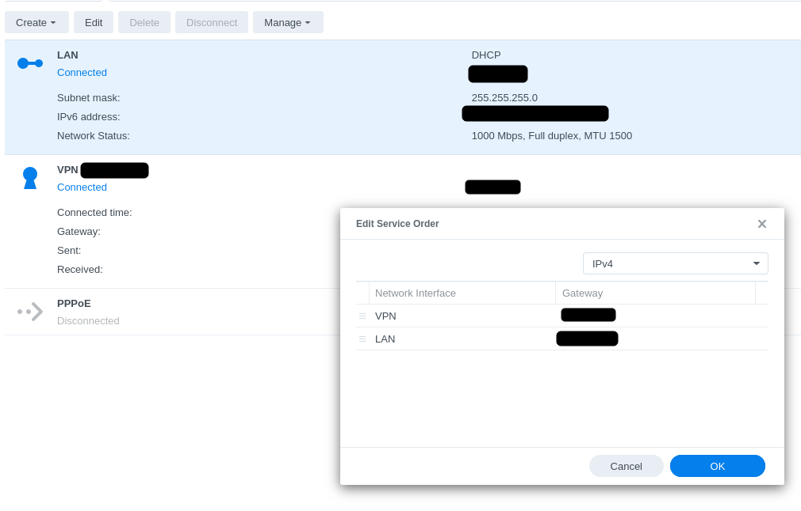
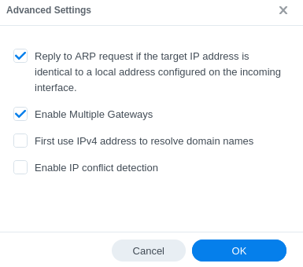
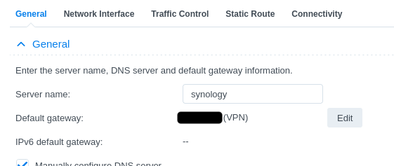
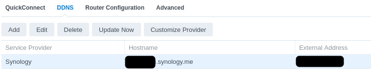
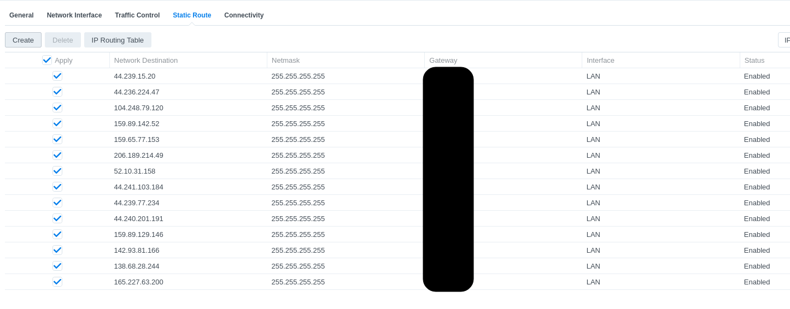

# Synology DDNS and VPN configuration

This article aims to explain how to configure your Synology NAS to have external access using DDNS (Dynamic DNS, ex. `https://foobar.synology.me:5001`) **AND** VPN to have secure tunneling from your apps - e.g. Download Station. The root cause of the problem is that once you configure VPN and DDNS on your Synology NAS, Synology will expose your VPN IP address to the DDNS, and the access from the internet to the NAS will be blocked - VPN providers do not route incoming traffic on specific port to specific (yours) IP address. In this solution we will specifically route particular IP addresses to use the LAN interface instead of VPN.

This is mainly meant for lower-end devices, since for higher-end once it is possible (and probably easier) to set up Docker container and routing all network traffic from the container to the VPN. But for example for DS218play this is not an option.

## Configure DDNS

1. Make sure you have only LAN connection in Control Panel 🠪 Network 🠪 Network Interface. You will add VPN connection later on.
2. Configure your DDNS according to [Synology instructions](https://kb.synology.com/en-us/DSM/help/DSM/AdminCenter/connection_ddns?version=6)
3. [Add certificate (e.g. via Let's Encrypt)](https://kb.synology.com/en-global/DSM/tutorial/How_to_enable_HTTPS_and_create_a_certificate_signing_request_on_your_Synology_NAS)
4. Setup port forwarding rules on your router. Minimal configuration is to forward only port 5001 (for HTTPS connection) or 5000 (for HTTP connection). I highly recommend to never use HTTP connection - you don't want your password to be exposed in plain text. If you are unsure if you configured your router correctly. You may first try to find DMZ option in your router configuration and point it to Synology IP. **It will basically expose NAS to your public IP, so do it only for a short period of time, don't leave DMZ enabled forever!** (until you are really sure what you are doing).
5. Make sure your setup works correctly - try to connect from other network (like your smartphone disconnected from your Wi-Fi) to `https://foobar.synology.me:5001`. It's **very important to have it working at this stage**

## Configure VPN

1. Go to Control Panel 🠪 Network 🠪 Network Interface and add your VPN connection.
2. In the same tab click Manage 🠪 Service Order and make sure VPN is your first choice - this will make sure all the traffic goes through VPN by default. 
3. Now go to Control Panel 🠪 Network 🠪 General and click *Advanced Settings* and make sure **Enable Multiple Gateways** is ticked. This will allow creating custom routing later on 
4. Make sure the Default gateway (in the same tab) is set to your VPN connection. 
5. Now all your network traffic should go through VPN. Let's test if it's really the case. Firstly, open some website which allows such verification via torrent, e.g. [this one](http://checkmyip.torrentprivacy.com/). Secondly, check what is the IP address to which our DDNS name points to. Go to Control Panel 🠪 External Access 🠪 DDNS, select your DDNS and click *Update Now*. In *External Address* field you will see IP address of your VPN provider, not your WAN. 
6. Now it's time to fix the problem - you want DDNS to point to **your WAN** IP address. If you use Synology as your DDNS provider, you should be fine with the IP addresses listed below, if not, see next section to learn how to get those addresses by yourself.
   1. Go to Control Panel 🠪 Network 🠪 Static Route
   2. Add rules with all IP addresses listed below with the following settings
      - Netmask: **255.255.255.255**
      - Gateway: *IP address of your LAN gateway*, e.g: **192.168.0.1**
      - Interface: **LAN**
   3. IP addresses to route (in case of Synology DDNS provider, e.g. *foobar.synology.me*):
      - `44.239.77.234`
      - `44.240.201.191`
      - `44.236.224.47`
      - `52.10.31.158`
      - `44.241.103.184`
      - `44.239.15.20`
      - `159.89.129.146`
      - `142.93.81.166`
      - `138.68.28.244`
      - `165.227.63.200`
      - `104.248.79.120`
      - `159.89.142.52`
      - `159.65.77.153`
      - `206.189.214.49`
   4. The logic behind this is that Synology periodically informs DDNS service what is its current IP address, and Synology uses above IP addresses for its service, so we route packets to those addresses through our LAN interface, not VPN, those skipping VPN connection. 
   5. Verify that DDNS now sends your WAN address. Go again to Control Panel 🠪 External Access 🠪 DDNS and push *Update Now*. You should see your WAN address now.
7. Wait some time for DNS to propagate and try to log in to your NAS via https://foobar.synology.me:5001. You may verify again if network traffic from Download Station is still routed through VPN. Enjoy :smirk:


### How to figure out IP addresses for routing purposes

This part is more technical, and you need to have SSH access to your NAS and have tcpdump installed.

- [Configure SSH](https://kb.synology.com/en-global/DSM/tutorial/How_to_login_to_DSM_with_root_permission_via_SSH_Telnet)

Firstly, I thought how to catch to which server does Synology report its heartbeats. The easiest way is to use `tcpdump` tool, so I gave it a shot with the simplest configuration I could think of:

```bash
$ sudo tcpdump | grep synology
```

And then I opened Control Panel 🠪 External Access 🠪 DDNS and pushed *Update Now*. And I noticed 2 addresses which are repeatedly visible in the console:

- ddns.synology.com
- checkip.digitalocean.synology.com

Next step is to figure out, what IP addresses are associated with those domains. Below commands, you can run either on Synology or your PC, result should be exactly the same:

```bash
$ nslookup ddns.synology.com
Server:		192.168.0.1
Address:	192.168.0.1#53

Non-authoritative answer:
ddns.synology.com	canonical name = ddns-global.quickconnect.to.
Name:	ddns-global.quickconnect.to
Address: 44.239.77.234
Name:	ddns-global.quickconnect.to
Address: 44.240.201.191
Name:	ddns-global.quickconnect.to
Address: 44.236.224.47
Name:	ddns-global.quickconnect.to
Address: 52.10.31.158
Name:	ddns-global.quickconnect.to
Address: 44.241.103.184
Name:	ddns-global.quickconnect.to
Address: 44.239.15.20
```

```bash
$ nslookup checkip.digitalocean.synology.com
Server:		192.168.0.1
Address:	192.168.0.1#53

Non-authoritative answer:
Name:	checkip.digitalocean.synology.com
Address: 159.89.129.146
Name:	checkip.digitalocean.synology.com
Address: 142.93.81.166
Name:	checkip.digitalocean.synology.com
Address: 138.68.28.244
Name:	checkip.digitalocean.synology.com
Address: 165.227.63.200
Name:	checkip.digitalocean.synology.com
Address: 104.248.79.120
Name:	checkip.digitalocean.synology.com
Address: 159.89.142.52
Name:	checkip.digitalocean.synology.com
Address: 159.65.77.153
Name:	checkip.digitalocean.synology.com
Address: 206.189.214.49
```

And that's it - I simply used above IP addresses in Static route table and it worked like a charm.
